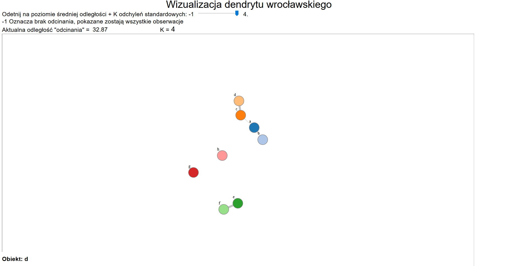

# Vis-AW
ENG: Project that implements a taxonomy division method of "Dendryt Wrocławski" based on distance matrix generated from Excel data, and visualizes in on Javascript d3 graph with fixed length edges, and also allows for a data grupping based on cutting the critical value that is at the basis of the method.

PL:
Jak powinien być sformatowany plik Excela:

  - W arkuszu z danymi nie może znajdować sie nic poza macierza z danymi o obiektach,
  - Komórka "A1" musi być pusta,
  - W wierszu "1" powinny znaleźć sie nazwy zmiennych,
  - W kolumnie "A" powinny znaleźć sie nazwy obiektów,
  - Nie ma ograniczenia na ilosc obiektow i zmiennych,
  - Jezeli o danym obiekcie brak informacji o danej zmiennej, nalezy wprowadzić tam 0
  
Plik "przykladowyExcel.xlsx" zawiera przykladowy wyglad arkusza, dla którego wizualizacja zadziala.

How to release:
- cd do folderu z programem
- python setup.py py2exe
- do dist dodac visualisation.html i folder "Wizualizacje"
- zrobic skrót gui.exe i dać np na pulpit
